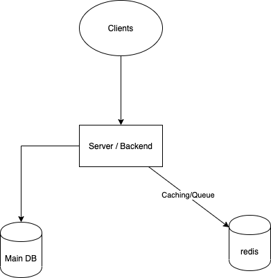
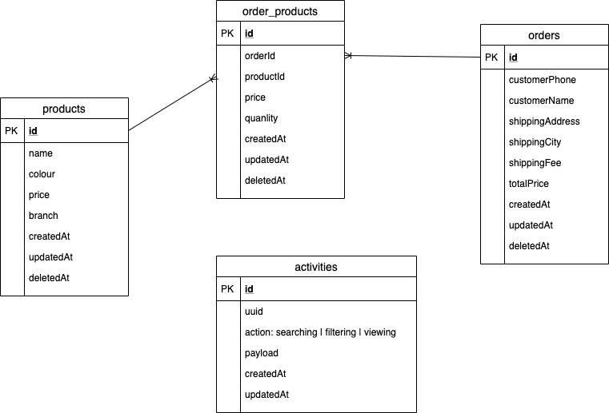

# NAB Assessment

## Table of Contents

<!-- START doctoc generated TOC please keep comment here to allow auto update -->
<!-- DON'T EDIT THIS SECTION, INSTEAD RE-RUN doctoc TO UPDATE -->

- [Getting Started](#getting-started)
  - [System Architecture](#system-architecture)
  - [Code structure](#code-structure)
  - [Requirements](#requirements)
  - [Development](#development)
  - [Migration](#Migration)
- [References](#references)

<!-- END doctoc generated TOC please keep comment here to allow auto update -->

## Getting started

### System Architecture
1. A high-level solution diagram for the components.

2. Entity relationship diagram for the database.

3. API Layer

* External - For user facing (need to optimize such as caching, ...)
- [x] GET api/external/products - Get, search, filter products
- [x] GET api/external/products/{id} - Get product detail

* Internal - For internal users like admin.
- [ ] POST api/internal/products - Create product
- [ ] GET api/internal/products/{id} - Get product detail
- [ ] PUT api/internal/products/{id} - Update product
- [ ] DELETE api/internal/products/{id} - Delete product
- [x] POST api/internal/orders - Make an order
- [ ] GET api/internal/orders/{id} - Get order detail
- [ ] PUT api/internal/orders/{id} - Update order detail
- [x] GET api/internal/activities - Get, filter list activities

### Code structure
    .
    ├── file                        # Documentation files
    ├── src                         # Source files
    │   ├── apis                    # Storing apis
    │   ├── commons                 # Common utils
    │   └── cores                   # Core bussines
    │   └── plugins                 # Plugins for happi
    ├── docker-compose.yml          # Build the database for developing
    └── README.md

### Requirements

- [Install **Docker**](https://docs.docker.com/install/)
- [Install **Docker Compose**](https://docs.docker.com/compose/install/)
- [Install **NodeJs**](https://nodejs.org/en/download/)

### Prepare for first setup

1. Install node modules: `npm install`

2. Build a local database: `docker-compose up --detach`

3. Migrate database: `npm run sequelize-cli db:migrate`

4. Seeds data for develop: `npm run sequelize-cli db:seed:all`

### Development

1. Run the app `npm run develop`

2. Run unit test `npm test`

3. Run unit test with coverage `npm run test:coverage`

4. Run linter `npm run lint`

### Migration
- Use this command line to create new model
`npx sequelize-cli model:generate --name User --attributes firstName:string,lastName:string,email:string`

- Migrate database: `npm run sequelize-cli db:migrate`

- Undo migrate: `npm run sequelize-cli db:migrate:undo`

## References
